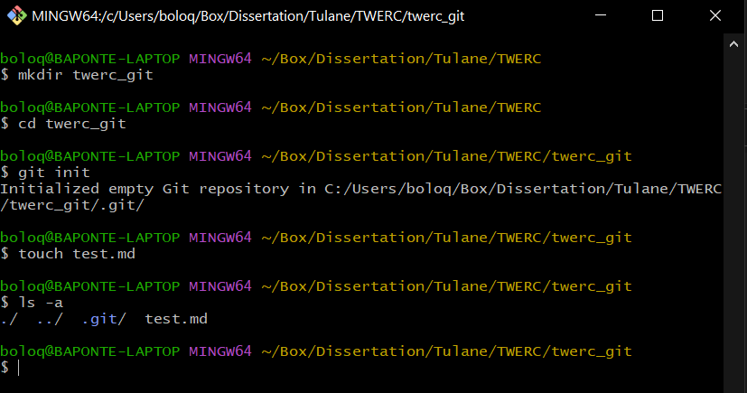
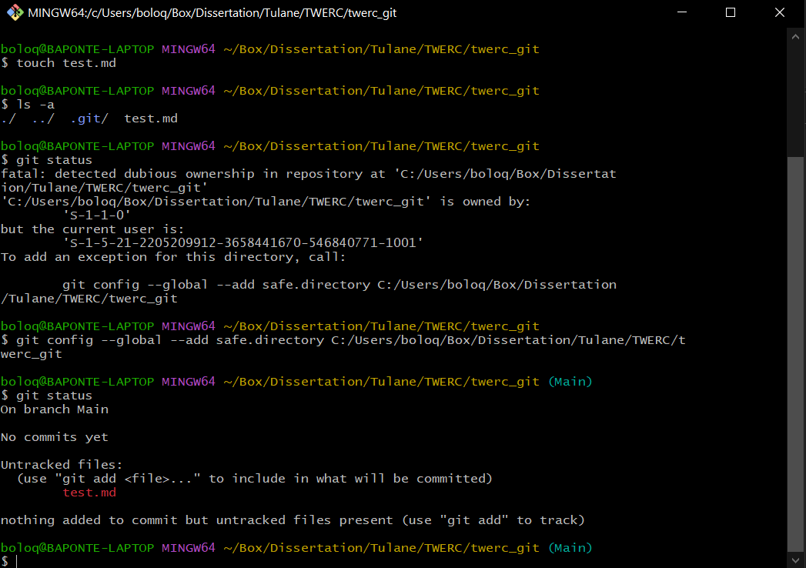
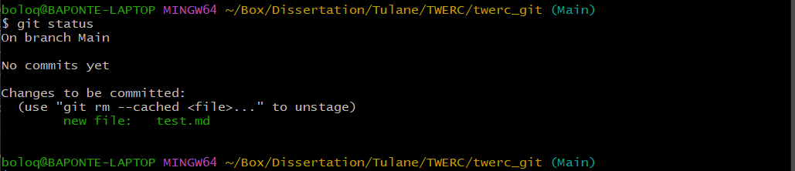

## Objective

This tutorial will teach you the basics of version control and track the
history of your projects (i.e. R scripts) with Git in *Windows*, *Mac*
and *Linux*. We will then learn how to share code and collaborate
through GitHub.

## What is version control?

We are familiar with this concept some way or another. Some of us save
multiple version of our code or manuscripts, culminating in the infamous
"manuscript_FINAL_FINAL_VERSION.docx" or similar. Others make copies of
files in another directory "just in case". This is a rudimentary form of
version control that works, but we can agree it is cumbersome.

To overcome this challenges, programmers developed various form of
version control, but all can be summarized as a "system that record
changes to a file or set of files over time" allowing recall to specific
version later on [@progit2014].

Git is a version control tool that lets users track the history of the
project so that previous versions are never lost. This is great for
collaboration as well as non-collaborative projects when we need to keep
track of our edits. Recently, there is interest for Ecology and
Evolutionary Biology (surely applicable to other fields as well) to use
Git and GitHub (or similar) to improve research workflows,
collaboration, transparency and open research [see
@bragaNotJustProgrammers2023].

### Prerequisites

-   Install Git

-   Register an account on [GitHub](https://github.com/).

-   Download [GitHub Desktop](https://desktop.github.com/)

## Installing Git

Let's check if you have Git installed already. For MacOS and Linux,
begin by opening a terminal (MacOS) or or console your Linux
distribution.

### Mac OS

Check whether Git is installed with the command:

`git --version`

-   **In MacOS** it should automatically prompt you to install Git if it
    is not available. See
    [here](https://git-scm.com/book/en/v2/Getting-Started-Installing-Git)
    for more details.
-   

##### Install with Homebrew

Using the [Homebrew](https://brew.sh/) package manager you can follow
these commands to install Git:

1.  Open your terminal and install Git using Homebrew:

`brew install git`

2.  Verify the installation was successful by typing `git --version`

You should see the most recent version installed.

### Linux (Debian/Ubuntu)

1.  Open up the terminal (shell) and install git with the command:

`sudo apt install git-all`

2.  Verify the installation was successful by typing `git --version`

This command may vary depending on your Linux distribution. See [this
link](https://git-scm.com/download/linux) for detailed instructions on
what command to use.

### Windows

1.  Download the [Windows installer](https://gitforwindows.org/)
2.  Follow the prompts.
3.  Open a Command Prompt (or Git Bash if during installation you
    elected not to use Git from the Windows Command Prompt).

::: callout-note
For Windows users, you may also consider a Linux
environment which can be installed on Windows 10 computers. To install
Linux in Windows, follow the instructions provided
[here](https://docs.microsoft.com/en-us/windows/wsl/install-win10).
:::

## Configuring Git

First we will **configure Git with our GitHub account details**. GitHub
is a hosting solution that allows us to easily share our Git
repositories with other users. In doing so it also serves a cloud
storage for your repositories in case something happens to your local
machine.

::: callout-warning
 Go back and open a GitHub account if you haven't done
so. We will be using it in the next part of the tutorial and in Part 2.
:::

To set your account details in git:

`git config --global user.name "Your GitHub username"`

`git config --global user.email "Your GitHub account email"`

Git can also operate independently of GitHub, or with other hosting
options such as [BitBucket](https://bitbucket.org/) or
[GitLab](https://about.gitlab.com/).

We can also **set our default command line text editor** for Git. By
default, Git will use the Vim editor on the command line. Command line
text editors can be confusing for users who are not used to working in
this environment. I recommend using nano for those that are new to the
command line, but Vim provides a more robust experience for those that
are open to learning a new tool.

`git config --global core.editor "nano -w"`

`git config --global core.editor "vim"`

You can check your configuration with the command:\

`git config --list`

## Your first repository

A repository is where Git saves the old versions of our files. We make
repositories inside of the directory that we are working in. **Let's
start by making a new working directory**. I will provide command line
code for those that are new to working this way.

`mkdir twerc_git`

`cd twerc_git`

With these commands, we have made a "GitTut" directory to work in, and
then navigated into the directory with the "cd" command. Now that we are
in our working directory, we **create a Git repository with the
command**:

`git init`

::: callout-note
 You should see text in parenthesis (e.g. "(Main)") at
the end of the path to your working directory. If not, we have to
configure "global' options for the repository. See below.
:::

Now let's create a test file.

`touch test.md`

The `touch` command creates the file. This command creates a new text
file "test.md" that can be opened with the text editor of your choice,
either at the command line or with a GUI based editor like Word or
Notepad.

Let's see our new repository in the directory, use the command:

`ls -a`

You will see an output like this:\

See the `test.md` file we just created.

The `.git` directory indicates that a repository has been created for
your working directory. All sub-directories within your working
directory will also be backed up in this repository as long as you the
Git to track them.

We can also **check the project status** with the command:

`git status`

You will see this output:\

In this example, `git status` prompted and error message after detection
of a "dubious" ownership (Figure 2). Copy and paste into the command
line the exception command offered by Git. After this, enter
`git status` again.

Some files are already tracked in the image presented, but look closely
at the newly created file. It is marked as "untracked". This simply
means this file is new to the directory and has not yet been added to
the repository.

For now, this means all is good! We will be returning to this status
screen often.

## Tracking file changes

Now we are on to the bread and butter of using Git. Make sure that you
are still in your "twerc_git" directory before proceeding. You can check
your current directory with the command `pwd`. This is important because
ewe don't want to start a repository in the wrong directory or our
computer's root directory.

We already created a file called `test.md`. Now let's modify it with
`nano`:

`nano test.md`

Enter some text into the file, then exit `nano` with `Ctrl + x`. Nano
will automatically prompt you to save when exiting.

We can **track a new file** with the command:

`git add test.md`

Let's again **check the project status**:

`git status`

Let's check the project status:

::: callout-tip
You can start tracking your file from the start or at any point in your
project's history. Git does not track files unless you tell it. If you
want all the files in a directory to be tracked, you can type:

`git add .`

or

`git add -all`

This last command will track all files in the repository directory,
including hidden files.
:::

##### Commiting changes

When we used `git add test.md` started tracking the file. The new file
is now being tracked but has not yet been "committed".

Committing a change creates a snapshot of your file at that time and
stage. Each "commit" is a preserved state of your project that can be
recalled in the future. The commit command will preserve any changes
that have been "added" to the staging area.

Let's try.

We can **commit our changes** with the command:

`git commit -m "ADD A DESCRIPTION HERE"`

The "descriptive message" is created by the argument `-m`, short for
"message". It should be a short and clear statement about the changes
that were made, so that it's easy to identify the changes associated
with the that particular commit later on. If you do not enter the `-m`
argument Git will automatically open your default text editor so you can
write a longer message detailing the changes in the commit. Spending a
few extra seconds writing a good descriptive message will help you and
others understand the history of the project. Think of it as good class
notes!

After you've run this command, check your `git status` again and your
repository is now current with the status of your directory.

To **see a log of the commits we've made**, we can use the command:

`git log`

The output of this command will show you who made the commit, when the
commit was made, the branch it occured in, and the descriptive message
you entered when you made the commit. It contains the `checksum`
associated with each commit. It is a unique identification number that
Git creates when all changes have been successfully stored. This number
will be different for each local machine.

Let's edit the file again to see how Git tracks changes between
versions. Open the text file and change the contents, then save the file
and close it.

## Showing Changes In Repository

To **view the changes** between the edits you've made and what was saved
in your last commit, use the command:

`git diff`

Look at the output of this command and understand where it's showing you
what has been removed and what has been added. The previous version
(marked a/test.md) and the current version (b/test.md). Additions to the
file are indicated with a "+" and deletions with a "-" at the beginning
of the line [@computing_for_biologists].

Let's commit this change before moving on:\

`git add test.md`\

`git commit -m "DESCRIPTIVE MESSAGE"`\

`git status`

#### Let's Practice

We can **control what files in our directory are added to any given
commit** with selective use of the add function. Let's make a new file
to see how this works:

`touch new_test.md`

Now edit the text in both the first and second text files and save your
changes.

Add each file to the staging area and commit them.

`git add test.md new_test.md`

Once you've done this, check your `git status` to see that your working
directory is synced with your most recent commit, and use `git log` to
see all of the changes you've done so far.

Your output should look something like this:

## Ammending an Incomplete Commit

Sometime we forget to add a file to our commit command or we forgot to
change that crucial line in our code. How do we fix that? We have two
options: 1) ammend our commit, 2) "unstage" our file

## Comparing commits and returning to old commits

Each commit in your git log has a unique commit ID. We can use these IDs
to **compare the changes that have been made between commits**. Let's
try this now. Copy the commit number of your first commit and then use
this command:

`git diff commit #`

You will get an extended log of what we saw previously with the `diff`
command, showing all of the changes that have been made since the first
commit.

This output shows us the changes we have made in painful detail. How can
we fix the problems that we've made for ourselves? We can **restore a
desired version of a file** with the checkout command.

`git checkout commit# abstract.txt`

Woohoo! Let's commit this change so that the most recent commit contains
both versions of the commit we desire.

This is all we will cover on the core functionality of git today. There
is a more comprehensive tutorial on Git that this was adapted from on
the [Software Carpentry
website.](https://swcarpentry.github.io/git-novice/) I highly recommend
working through the rest of it on your own or with a partner!

## Collaborating with GitHub

Tracking changes in your local repository is a good practice, espcially
so when you are collaborating with others. Projects with collaborators
are important and nobody wants be the one who delete a file by mistake.
For this purpose software developers and scientist use Github to share
there code, collaborate and promote reproducibility. GitHub is merely a
service that allows us to easily share out git repos with our
collaborators. You can host fully remote repositories as well as connect
your local repository with a remote. To achieve this we will learn a few
more commands to translate working with Git to working with GitHub.

::: callout-tip
\You should all have GitHub accounts. If not, pause and
create one.
:::

Go to the GitHub repository for today's lesson:\
<https://github.com/TulaniansWERC/GitTut_Sep2023.git>

\
You want to **clone this repository** to your computer. To do this, copy
the HTTPS address given on the webpage (or if you know it you can just
type it in manually in the command line.

`git clone https://github.com/TulaniansWERC/GitTut_Sep2023.git`

On the command line, navigate to a location on your computer that you
want to clone the repository to. To clone a repository:

`git clone https://github.com/tulaneURF/10_23_2019.git`

Now navigate into this new directory. Let's use `ls -a` and `git status`
to check that this directory has a git repository associated with it.

How does this local repository communicate with GitHub? It uses a
remote, which links it to the GitHub repo. We **can see what remotes are
associated with a repo** with the command:

`git remote -v`

This shows us the name of the remote and where it is addressed to.
Remotes tell git where to "push" and "pull" from.

::: callout-note
 Not every cloned repository will allow you to `push` and
`pull`. The administrators of said repositories establish who
contributes or not. Make sure you are authorized to collaborate with a
project or repository by contacting the administrators of it.
:::

Now we all have the same directory. How do we share the changes that we
make with each other? We will work with this repo the same as we would
any other, we just have to add one extra step at the end.

*I will show you one example first before you try.*

Now that I have pushed my commit up to GitHub, you will need to pull my
changes down so that you have the most recent commit. **This completes
the basic GitHub workflow:**

-   `git pull origin master` updates your repo to the most recent
    version.
-   Edit the files you wish to change.
-   `git add editedfile.extension` stages the modified files to be
    committed.
-   `git commit -m "commit message"` creates a commit from the staged
    changes.
-   `git push origin master` pushes the commit to GitHub so that your
    collaborators can pull your edits.

That's probably all we're getting through today! If we have time I can
show you how conflicts between commits are resolved and how to
initialize your own remotes. Thanks for coming!

## References

::: {#refs}
:::

-   <https://swcarpentry.github.io/git-novice/>

-   <https://git-scm.com/book/en/v2/Git-Basics-Recording-Changes-to-the-Repository>
